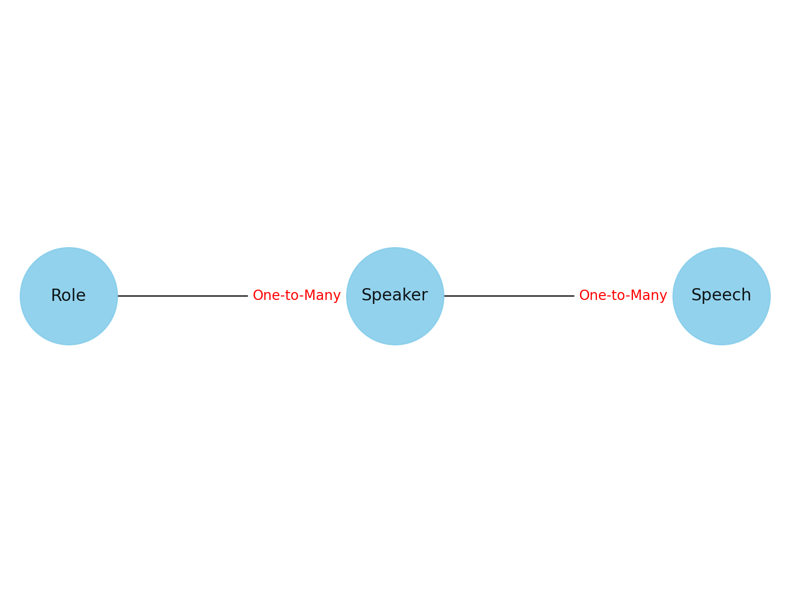

[Speech]
*SpeechID
Speaker {label: "string"}
Content {label: "string"}

Example text: 
```
Council Member: Good evening, everyone. Let's start our meeting.

Public: Hi, I am a local resident and I have some concerns about the new parking rules.

Council Member: Can you elaborate on your concerns?

Public: Yes, the parking rules are making it difficult for residents to park near their homes. 
Many of us don't have garages and rely on street parking.

Inter-Governmental Agency: We've received your concerns and we're looking into adjustments.

Civic Society: We've done a survey in the area and most people agree with the resident.
```

Example parsing function:
```
roles = ["Council Member", "Public", "Inter-Governmental", "Civic Society"]

with open('full-council-meeting-1-1-2023.txt', 'r') as file:
    lines = file.readlines()

speeches = []
current_role = None
current_content = ""

for line in lines:
    line = line.strip()
    if any(line.startswith(role + ":") for role in roles):
        if current_role is not None:
            speeches.append({"Role": current_role, "Content": current_content.strip()})
        current_role, current_content = line.split(":", 1)
        current_role = current_role.strip()
        current_content = current_content.strip()
    else:
        current_content += " " + line

if current_role is not None:
    speeches.append({"Role": current_role, "Content": current_content.strip()})

with open('parsed_transcript.json', 'w') as file:
    json.dump(speeches, file, indent=4)
```